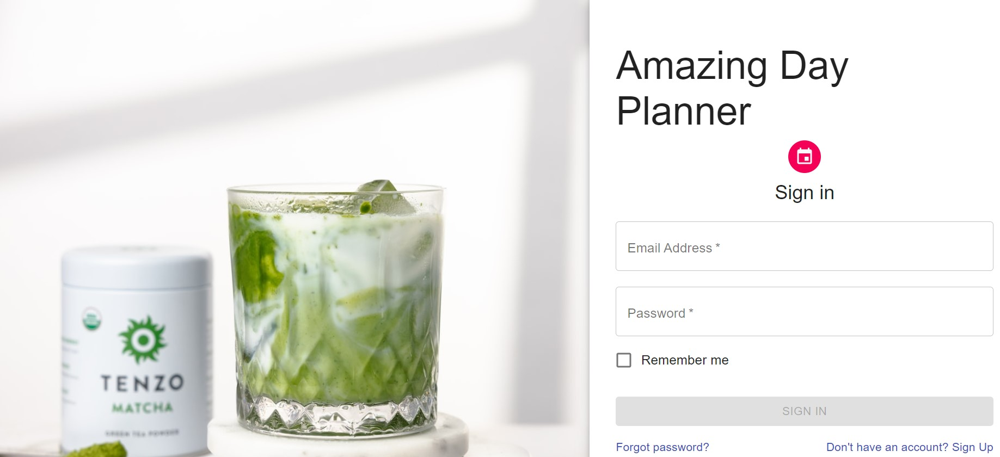

# Built-a-Portfolio
The present project consist on building my portfolio to be deployed online

## Description
The project is a homework from the bootcamp class, in which each student is required to built a portfolio page using html and css. The portfolio is important as it provides to potentiel employers  with your skills and know how and can be critical for further consideration in a hiring process.

### User Story

A potentiel employer can view my deployed portfolio of projects, review samples of my work and assess whether I am a good candidate for an open position.

#### Installation

 The differents sections developped in my portfolio are:

A header Section consisting of My name, and links to sections about Me, my Project, my contact information and a downlable resume.If I click on the navigation links in the header section, then the UI scrolls to the corresponding section.
An About Me section where a recent photo, my skills and some information about me are displayed. 
A section dedicated to projects where I present the first project with an image larger than the others project's images. The name (SportBets) of the project is displayed as well as the Github and deployed links. The others images are only background and will be replaced by real projects as the classes go on. 
A section showing my contact information, notably Email, LinkedIn, Github and Phone.
The portfolio was built in a responsive fashion able to adapt to differents viewports.

##### Technologies used
HTML, CSS

###### Usage

###### Link and Credit
https://alcharl88.github.io/Portfolio/

Alain Tagne
https://github.com/AlCharl88